# Analyse Problem

A customer web application under src using Node.js, Express.js (Sequelize) and PostgreSQL is created. But issue with current build, testing and packing is that these processes are being done manually from lead developer's laptop. This is a big issue because if the lead developer is not available when an important build, test & packing of the application is needed for a customer, nobody else can do the process and hence, the customer will need to wait 

## Problem Consequences

- High risk that bugs appear in production due to the overreliance on a single source of manual build and test. Therefore, testing might not always be performed every build and even if the build is successful in the local environment, the build might break in the production environment
- This increases number of support calls from the customer which leads to support and development team to work overtime to manage load and fix issues
- This leads to reduced morale with both of the teams and also impact future revenue of the company due to customer's dissatisfaction

# Solution

To resolve the problem of a single point of failure, the company should introduce role of DevOps. DevOps is a set of practices that works to automate and integrate the processes between development and operations teams, so they can build, test and package software faster. So, one of the sections of DevOps is **Continuous Integration** which is applied so that support and development teams focus on delivering new features rather than supporting old and broken ones

Under a hidden folder (.circleci), `config.yml` file is created to perform CI

## Why Continuous Integration (CI)?

CI is validating state of code every time a developer pushes a commit on any branch to git server. Each integration is verified by automated build, tests and packaging of application in a state ready for deployment. Packaging occurs on master branch as it will contain the completed application where all feature branches have merged to create full application

- Lower risk of bugs in production because bugs will be detected during automated tests stage as every time a developer pushes a contribution to shared repository, build and test are triggered because repository is linked to CI pipeline
- Adding a CI pipeline with these automated processes eliminates the need to rely on lead developer's laptop as all developers will have access to this shared repository, linked to the CI pipeline. This keeps production bug free because overall process breaks if any part of pipeline fails, encouraging developer to fix bugs quickly to get a success status

### CircleCI
*Setup:* Clone this project and link it to a repository which is going to be used. Then, make sure circleci and codecov is setup by following specific steps outlined in their websites. There is no need to create a new `config.yml` or any other files as all required files are present in this project

**Rules Of Thumb:** 
- Run for a max time of 15 minutes
- Fit as much validation as possible
- Run on every commit

*Failure Scenario:* A way to show that CircleCI breaks when one of the jobs fail, ensuring that all jobs have to pass before merging of new changes to production is possible. This helps to find bugs as soon as possible and ensures if a new feature is to be implemented to production, it must be break free. CircleCI helps with bug fixing by notifying through email that it has broken, plus providing failure details through error messages

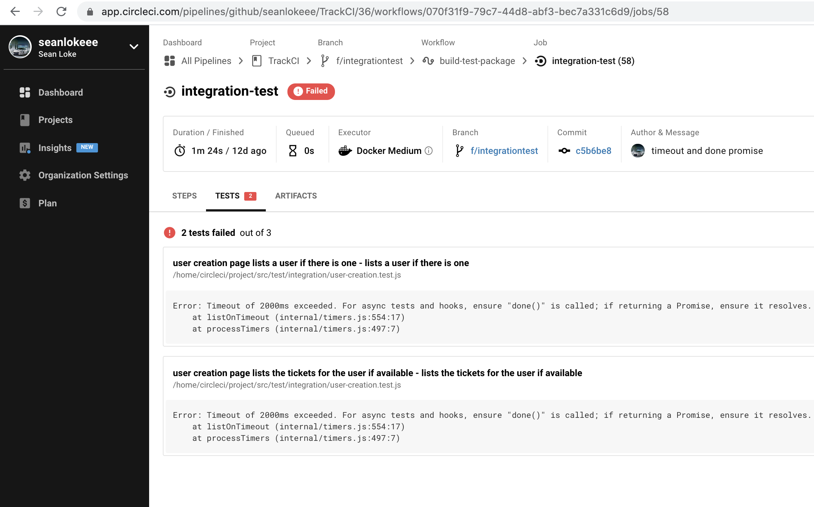

# Branching Strategy

Each branch has a CI pipeline so branching is the starting point so if it is complex, by the time get to automatic deployments into production, will have multiplied that complexity many times over because every step in the process multiplies complexity

**Do:**
- Simple as possible 
- Use Pull Requests to merge
- Integrate with CI

**Don't:**
- Branch per environment because not testing what is being deployed into production
- Branch to manage configuration because hard to keep application code in the same state

*Git Branch Name Format:* Starts with an alphabet (E.g. f/testing where f means that it is a feature branch) to differentiate it from other branches like hotfix

# Processes In CircleCI Pipeline

Processes below which currently performed locally are integrated to CI pipeline so that automatic tools assert pushed code's correctness before deployment, forcing developer to fix bugs when overall process fails

## General Tests Rules (DevOps Perspective)

Write more fast tests, and use slower tests to only test what you can't test with the fast ones. So, in this case, 3 tests are being performed, unit being the quickest and end-2-end being the slowest where integration is in between

Take note if all the tests succeed, the time to execute, code coverage and make sure that if executed tests have failed, people are notified. When something is broken, limit the bad impact on other people you work with (E.g. don't allow merging of broken code)

## Linting

Scan application code to make sure that everyone follows the same styling guidelines which ensures high code quality. Guidelines must be in place because different people working on the same project have different code indentation or there might be loops inside loops, slowing the application down. Therefore, linting ensures code readability by enforcing consistency

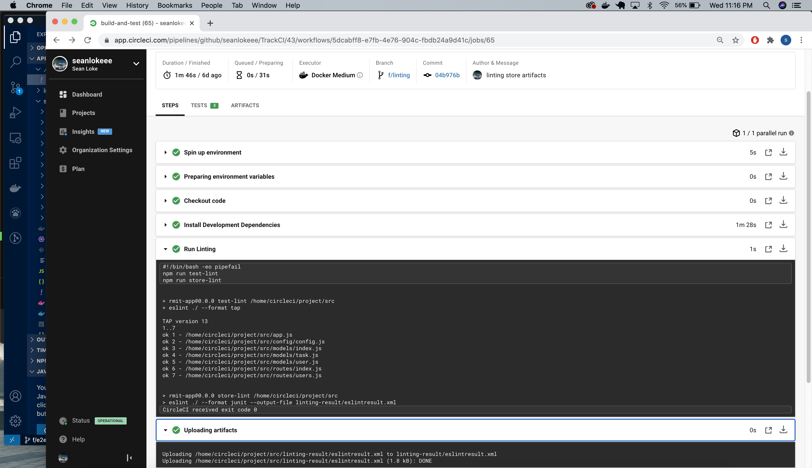

## Unit Testing 

Fast way to verify that the logic inside your application does what it is supposed to do. A great tool to verify that the implemented changes haven't had an adverse effect on another part of the application

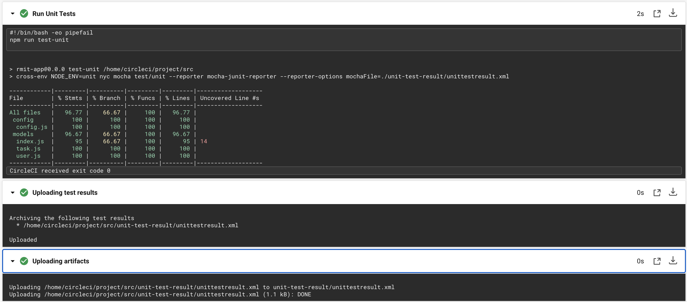

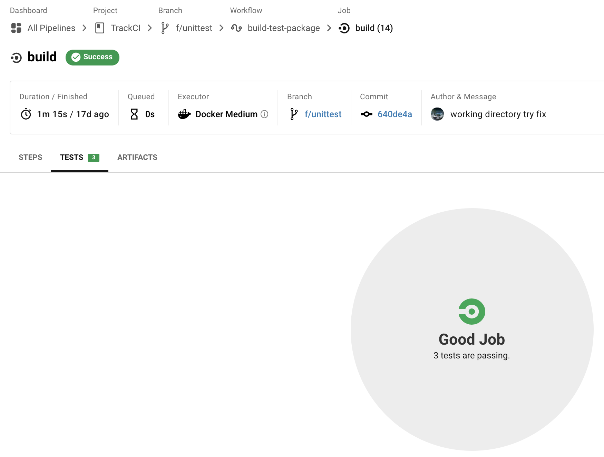

## Code Coverage

Describe % of application code covered by automated test suite to make sure that our tests cover majority of the logic in the application so that haven't missed anything major. A good code coverage % should be around 80%, depending on verbosity of language. 100% leads to developers gaming the system and not writing good tests

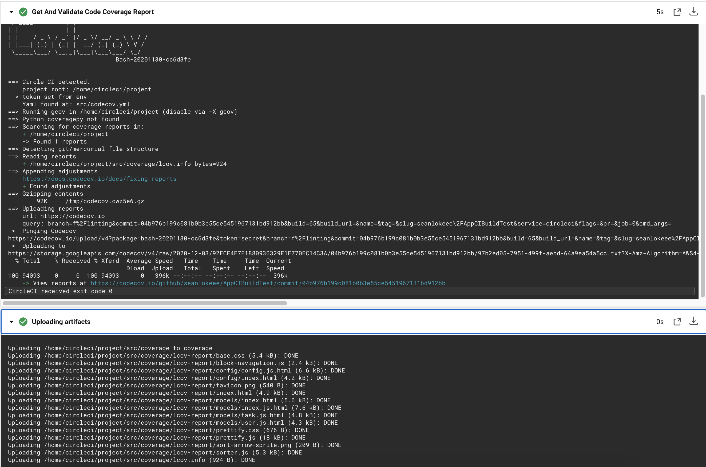

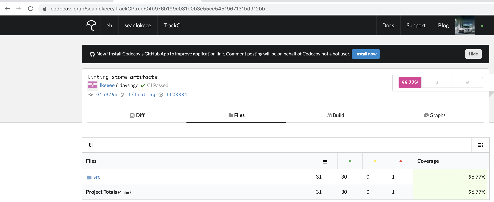

## Integration Testing

Test integrations between different components in the application, or integration to other services

Unlike with Unit Testing where you might pass in mocking or stubbing objects to replace external services like the database or REST APIs, with integration tests, you only change configuration, like you would do in a production environment because infrastructure or containers are deployed to run the integration tests properly

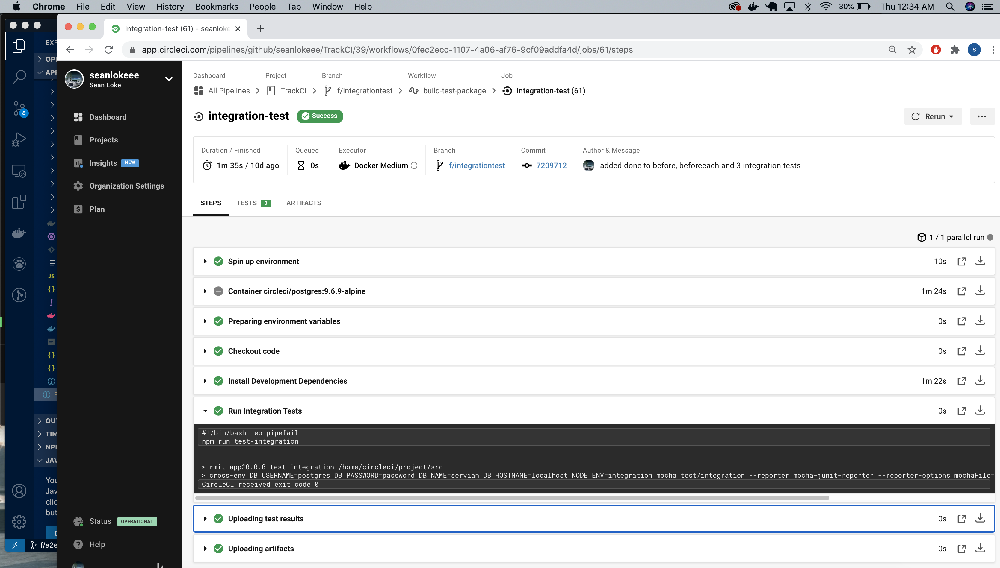

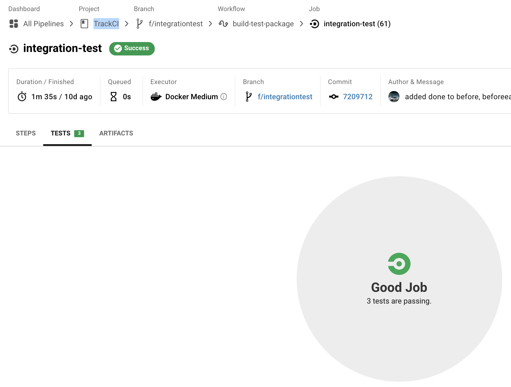

## E2E Testing

Ensure round trip testing from the browser to the DB and back again is successful which is testing whether the flow of an application in production is behaving as expected from start to finish. This spots out system dependencies and ensures that data integrity is maintained between different system components. Thus, it ensures entire web app is ready for deployment

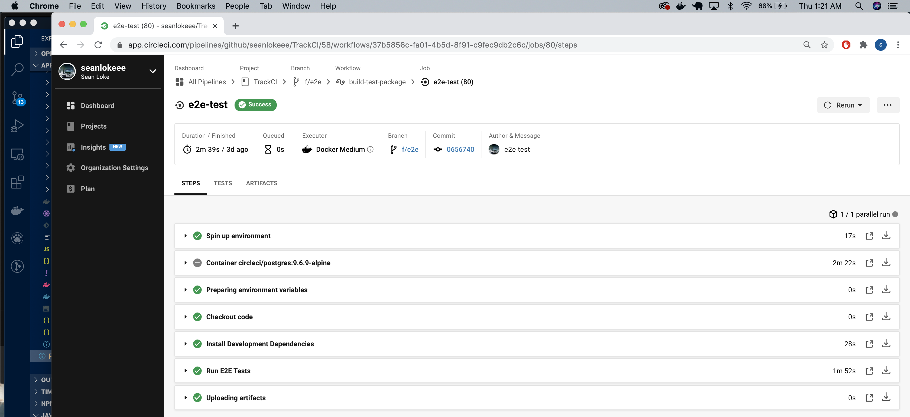

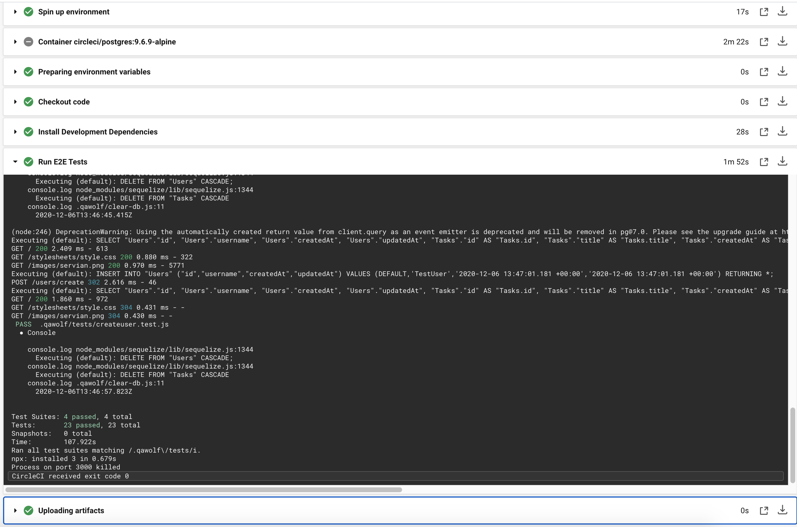

## Artifact
Multiple items are stored as artifacts on CI pipeline. One of the items is the entire application itself, packaging `src` folder with all installed dependencies and rest of the items are test, linting and coverage results. Other artifact files show in-depth details of final results which can be opened on the web browser through circleci so that developers can see them easily and if there is a failure, these extra details help in further debugging

*Packaging of whole application is generated only on master branch as feature branches don't contain all ready-to-go code, binaries and scripts. Generating package is a time consuming process so to reduce cost of overall CI process, it should only be done on release branch*

Running `NODE_ENV: production` for packaging complete application installs the required dependencies only
- added 1243 packages from 892 contributors and audited 1206781 packages in 23.638s (development)
- added 1094 packages from 591 contributors and audited 1206781 packages in 21.637s (production)

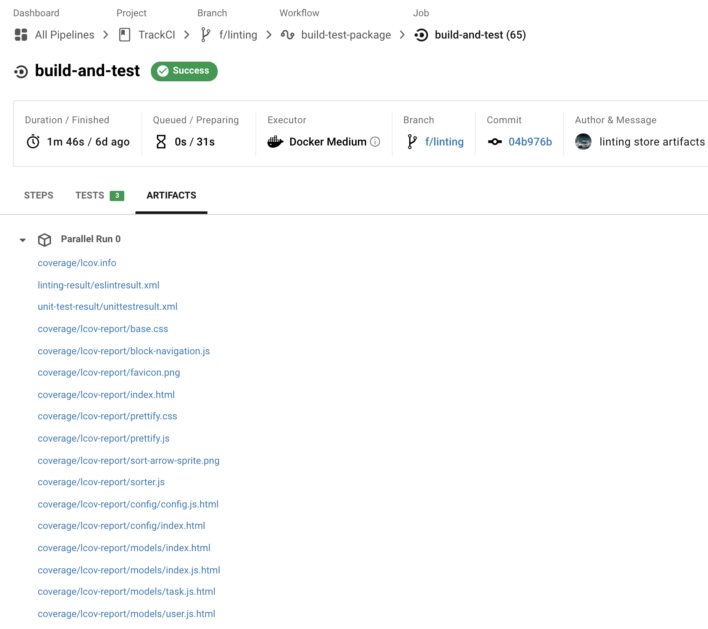

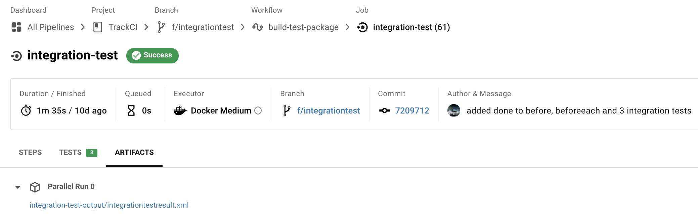

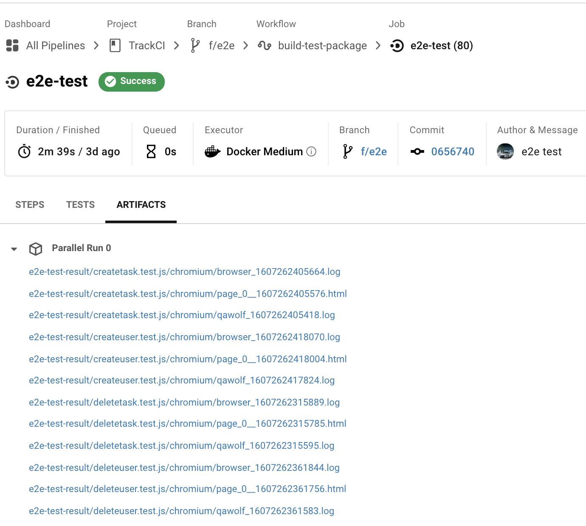